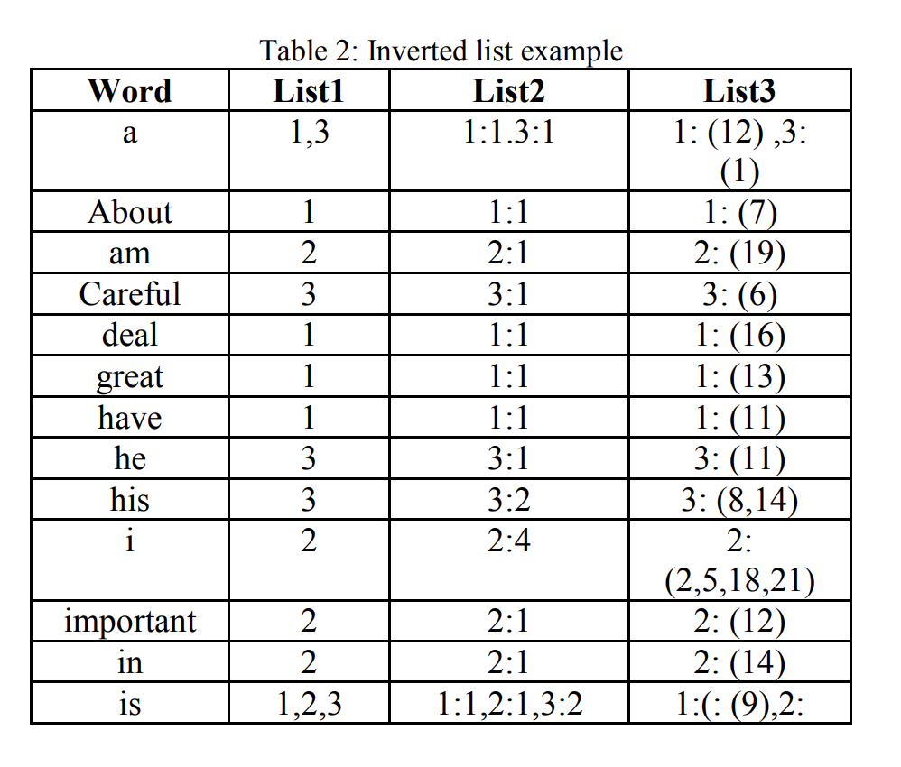
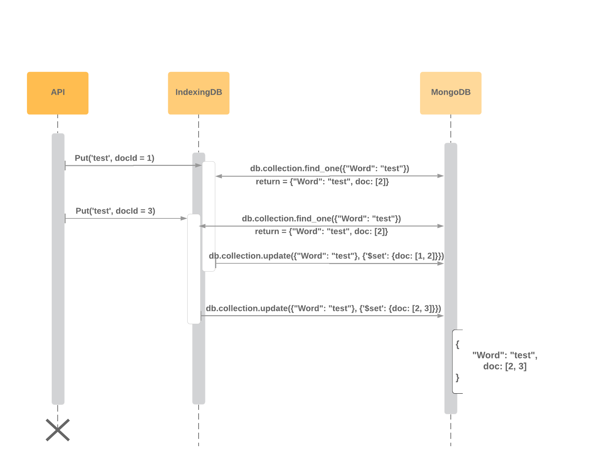
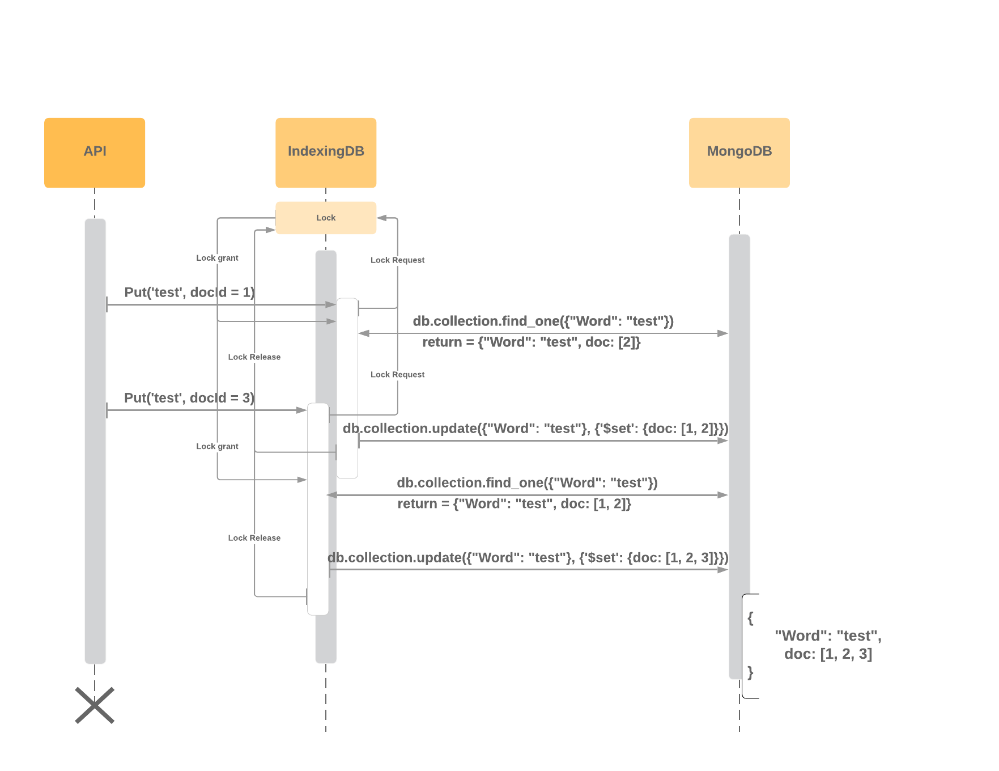

# IndexingDB Design

## User Interface

```
class IndexingDB:

# Write request

    def put(self, word, doc, pos)
    def update(self, word, doc, pos)

    def putBatch(self, word, mapping)
    def updateBatch(self, word, mapping)

    def delete(self, word, doc)

# Read request
    def get_word_doc(self, word)
    def get_word_freq(self, word)
    def get_word_doc_freq(self, word, doc)
    def get_word_pos(self, word)
    def get_word_doc_pos(self, word, doc)
```

* Write request
    * `def put(self, word, doc, pos)`:
        * put the word position lists to the document
        * note: this operation will not replace what already have on this word in database. E.g. assume word 'test' already in db, and have position [4, 5] for doc 6,
        if `put('test', 6, [4, 7])` is called, the db will update to position [4, 5, 7] for word 'test' in doc 6
    
    * `def update(self, word, doc, pos)`:
        * update will replace the original word information in db if the word exist, otherwise, works the same as put
        * note: this operation will replace what already have on this word in database. E.g assume word 'test' already in db, and have position [4, 5] for doc 6,
        if `update('test', 6, [1, 2, 3])` is called, the db will update to position [1, 2, 3] for word 'test' in doc 6
    
    * `def putBatch(self, word, mapping)`  
        * putBatch works similar to put, but write word with map of documents with position
        * mapping: a dictionary structure, contains documents ID with position in the dictionary
        * E.g mapping may be in this form `{1 : [2,3,4], 2:[20, 38], 7:[1]}`
    
    * `def updateBatch(self, word, mapping)`
        * updateBatch works similar to update, but update word with map of documents with position
        * mapping: a dictionary structure, contains documents ID with position in the dictionary
        * E.g mapping may be in this form `{1 : [2,3,4], 2:[20, 38], 7:[1]}`
        
    * `def delete(self, word, doc)`
        * delete the word associate the document
        * E.g assume word 'test' already in db, associate with document 1, 2, 6. `delete('test', 1)` will delete the document list, frequency list and position list in database

* Read request:
    * `def get_word_doc(self, word)`
        * get_word_doc return the list of document, where the word appear 
    * `def get_word_freq(self, word)`
        * get_word_freq return the total frequency of the word in all the documents
    * `def get_word_doc_freq(self, word, doc)`
        * get_word_doc_freq return the frequency of the word in given document
    * `def get_word_pos(self, word)`
        * get_word_pos return a dictionary structure, map the document to the list of position of the word in the document
        * E.g. a word appear in document 1 at position [2, 20, 23], appear in document 2 at position [1, 2], return `{1: [2, 20, 23], 2: [1, 2]}`
    * `def get_word_doc_pos(self, word, doc)`
        * get_word_doc_pos return a list of position of the word in given document


## Table structure

* Inverted indexes maps a word to three lists where
    * List1: Document lists, the format is (d1, d2, ...), where dn is the document id number
    * List2: Document lists with word frequencies. The format is (d1:f1, d2:f2, ...), where dn is the document id number and fn is the word frequency
    * List3: Document lists and word positions with word granularity. The format is (d1:(w1, w2...), d2: (w1, w2 ...) ...), where dn is the document id number and wn are the word positions
    
    
    
* DB structure
    * As shown in the table, it could be translated into the following structure and store in mongodb
    * Example shows a word 'test', which in documents 1, 2, and 3, with frequency 2, 1 and 3. 
    The position of the word in each document is doc1: [14,56], doc2: [20], doc3: [17, 40, 78]
    
    ```
    {
        "Word": "test",
        
        "List1": {
            "docs": [1, 2, 3]
        },
    
        "List2": {
            "word_freq": [
            {
                "doc": 1,
                "freq": 2
            },
    
            {
                "doc": 2,
                "freq": 1
            },
    
            {
                "doc": 3,
                "freq": 3
            }]
        },
    
        "List3": {
            "word_pos": [
            {
                "doc": 1,
                "pos": [14, 56]
            },
    
            {
                "doc": 2,
                "pos": [20]
            },
    
            {
                "doc": 3,
                "pos": [17, 40, 78]
            }]
        }
    }
    ```

* Use of mongoDB indexing
    * For accelerating queries and make sure the word indexing appear only once in the collection, do index on the word
    
        ```
        db.posts.create_index([("Word", pymongo.ASCENDING)], unique=True)
        ```
      
## WRLock
* WRLock should block the write request when the previous write request haven't finish the process
* If there is no WRLock, when two write request starting at the same time, one of them would get lost. As shown in picture
* The basic process of updating the index word is query and push back the data with newly put document Id and position 


* With Lock, write request start in serial, as picture shown


* To improve the query speed, lock can be implement in unit of 'sector', which lock the operation on a same word. That's is to say,
for write request on different words, them won't affect each other, and could be run in parallel